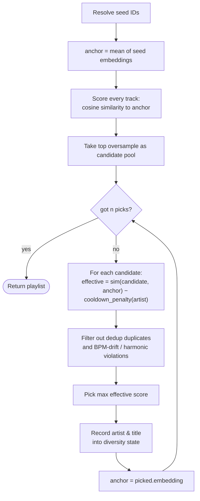
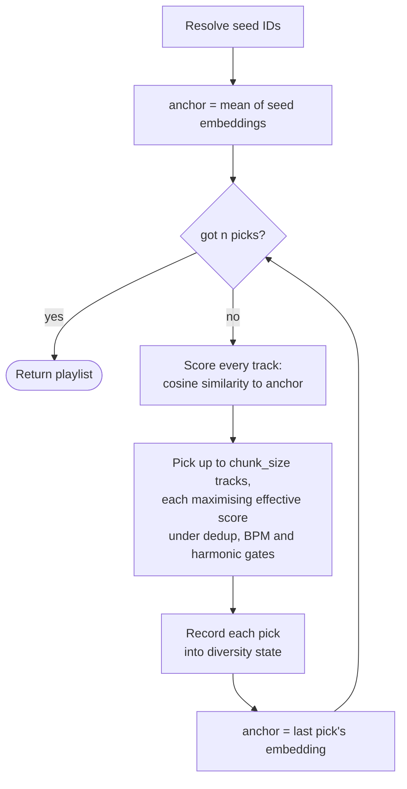
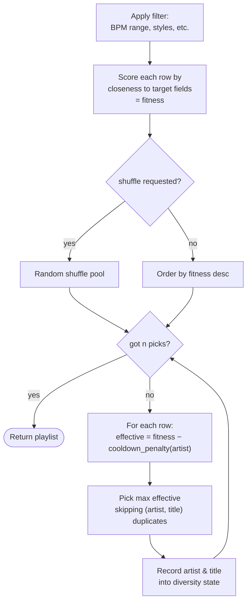

# harmonie HTTP API

REST API for similarity queries, genre/style filtering, and playlist generation.

* Base URL: `http://<host>:<port>` — defaults to `http://localhost:8842`.
* All resource endpoints live under `/api/v1/`. `/health` is unversioned and public.
* OpenAPI spec at `/openapi.json`; interactive docs at `/docs`.
* Service installation, configuration, and operations: see [README.md](README.md).

## Contents

* [Conventions](#conventions)
* [Authentication](#authentication)
* [Filtering](#filtering)
* [Track resolution](#track-resolution)
* [Tracks](#tracks)
    * [List tracks](#list-tracks) — `GET /api/v1/tracks`
    * [Get a track](#get-a-track) — `GET /api/v1/tracks/{id}`
    * [Find similar tracks](#find-similar-tracks) — `GET /api/v1/tracks/{id}/similar`
    * [Resolve a track](#resolve-a-track) — `GET /api/v1/tracks/resolve`
* [Genres and styles](#genres-and-styles)
    * [List genres](#list-genres) — `GET /api/v1/genres`
    * [List styles](#list-styles) — `GET /api/v1/styles`
* [Playlists](#playlists) — `POST /api/v1/playlists`
    * [Mode `similar`](#mode-similar--track-radio) — track radio
    * [Mode `drift`](#mode-drift--chunked-walk) — chunked walk
    * [Mode `vibe`](#mode-vibe--descriptor-driven) — descriptor-driven
    * [Inline seed references](#inline-seed-references)
* [Service](#service)
    * [Service status](#service-status) — `GET /api/v1/status`
    * [Scan state](#scan-state) — `GET /api/v1/scan`
    * [Trigger scan](#trigger-scan) — `POST /api/v1/scan`
    * [Liveness](#liveness) — `GET /health`
* [Recipes](#recipes)

---

## Conventions

**Versioning.** Resource endpoints are stable under `/api/v1/`. Breaking changes ship as `/api/v2/`.

**Content type.** Requests and responses are `application/json` unless otherwise noted. Query parameters use the standard URL form.

**Errors.** Failures return a non-2xx status and a JSON body:

```json
{ "detail": "no matching track" }
```

Codes used across endpoints:

| Status | Meaning |
| --- | --- |
| `400` | Malformed request (invalid filter syntax, missing required field). |
| `401` | Missing or wrong API key. |
| `404` | Resource not found. |
| `422` | Schema validation failure. |
| `503` | Service still initialising — analyzer not ready. |

Endpoints document additional codes in their **Errors** subsection.

**Pagination.** List endpoints accept `limit` (default `100`, max `1000`) and `offset` (default `0`). Responses include the total count:

```json
{ "items": [...], "total": 4823, "limit": 100, "offset": 0 }
```

---

## Authentication

If `HARMONIE_API_KEY` is set, every request to `/api/v1/*` must include the key in the `X-API-Key` header. `/health` is always public.

```bash
curl -H 'X-API-Key: s3cret' http://localhost:8842/api/v1/status
```

When `HARMONIE_API_KEY` is unset, no authentication is enforced.

---

## Filtering

The same filter language gates list, similarity, and playlist queries. Two surfaces — URL parameters on `GET` endpoints and a JSON `filter` block on `POST /playlists` — produce the same constraint object.

**URL form**

```
?bpm=120..130        closed range
?bpm=120..           lower bound only
?bpm=..130           upper bound only
?bpm=128             exact value
?key=A&key=B         set membership (repeat the parameter)
?genre=Electronic    every Electronic--- track
?style=House         every ---House track across genres
?genre=Electronic&style=House   exact Electronic---House
?style_min=0.5       only count style rows above this probability
?style_mode=all      tracks must match every requested constraint (default: any)
```

**Body form** (under `POST /playlists` → `filter`)

```json
{
  "filter": {
    "bpm":      { "gte": 120, "lte": 130 },
    "loudness": { "lte": -10 },
    "key":      ["A", "B"],
    "scale":    "minor",
    "genre":    ["Electronic"],
    "style":    ["House"],
    "style_min": 0.5,
    "style_mode": "any"
  }
}
```

**Parameters**

| Name | Type | Description |
| --- | --- | --- |
| `bpm` | range | Tempo in beats per minute. |
| `danceability` | range | Essentia danceability score. Higher = more danceable. |
| `loudness` | range | ReplayGain loudness in dB (negative numbers). |
| `key` | string\[\] | Pitch class. Repeat for OR. |
| `scale` | string | `major` or `minor`. |
| `genre` | string\[\] | Discogs genre — left side of `Genre---Style`. Repeat for OR. |
| `style` | string\[\] | Discogs style — right side of `Genre---Style`. Repeat for OR. |
| `style_min` | float | Min classifier probability for a style row to count. `0.0`–`1.0`. |
| `style_mode` | string | `any` (default) or `all` of the requested genre/style constraints. |

`genre` and `style` values must not contain `---`. The separator is internal; pass both axes together for an exact label.

---

## Track resolution

`harmonie` identifies tracks by integer ID, but most clients only have a path or tags. The resolution ladder maps `{path, artist, album, title}` to a track ID, trying strategies in order and returning the first hit (smallest `id` on ties):

1. Exact match on absolute `path`.
2. Exact match on `relative_path` — handles mount-point mismatches.
3. Case-insensitive match on the (`artist`, `album`, `title`) triple.
4. Case-insensitive match on (`title`, `artist`) or (`title`, `album`).

Two surfaces use this ladder: [`GET /tracks/resolve`](#resolve-a-track) for one-off lookups and the `seed_refs` field on [`POST /playlists`](#post-apiv1playlists) for inline references.

---

## Tracks

### List tracks

`GET /api/v1/tracks`

Paginated track listing. All [filter parameters](#filtering) are accepted alongside the pagination fields below.

**Query parameters**

| Name | Type | Default | Description |
| --- | --- | --- | --- |
| `limit` | int | `100` | Page size. Max `1000`. |
| `offset` | int | `0` | Skip count. |
| `order_by` | string | `id` | One of `id`, `path`, `bpm`, `duration`, `analyzed_at`. |
| `model` | string | none | Restrict to one embedding model. |

**Response**

```json
{
  "items": [
    {
      "id": 42,
      "path": "/music/Aphex Twin/SAW/01 Xtal.flac",
      "library_root": "/music",
      "relative_path": "Aphex Twin/SAW/01 Xtal.flac",
      "duration": 312.4,
      "model": "discogs-effnet-bs64-1",
      "artist": "Aphex Twin",
      "album": "Selected Ambient Works",
      "title": "Xtal",
      "track_number": 1,
      "bpm": 88.2,
      "key": "A",
      "scale": "minor",
      "danceability": 1.31,
      "loudness": -16.4,
      "styles": [
        { "style": "Electronic---Ambient", "probability": 0.71 }
      ]
    }
  ],
  "total": 4823,
  "limit": 100,
  "offset": 0
}
```

**Example**

```bash
curl --get http://localhost:8842/api/v1/tracks \
  --data-urlencode 'genre=Electronic' \
  --data 'bpm=120..130' \
  --data 'order_by=bpm'
```

### Get a track

`GET /api/v1/tracks/{id}`

Full track record including raw descriptor fields not exposed in the list view.

**Response**

Adds these fields to the list-view shape:

| Field | Description |
| --- | --- |
| `size` | File size in bytes. |
| `mtime` | File modification time (Unix timestamp). |
| `embedding_dim` | Dimensionality of the stored embedding. |
| `descriptor_version` | Descriptor algorithm version at last extraction. |
| `bpm_confidence` | RhythmExtractor confidence. |
| `key_strength` | KeyExtractor confidence. |
| `onset_rate` | Onsets per second. |
| `analyzed_at` | Unix timestamp of last extraction. |

**Errors**

| Status | Cause |
| --- | --- |
| `404` | No track with the given `id`. |

**Example**

```bash
curl http://localhost:8842/api/v1/tracks/42
```

### Find similar tracks

`GET /api/v1/tracks/{id}/similar`

Top-N tracks ranked by cosine similarity to the query track's embedding. Results are restricted to the query track's model.

**Query parameters**

| Name | Type | Default | Description |
| --- | --- | --- | --- |
| `limit` | int | `10` | Number of matches. 1–500. |
| `include_self` | bool | `false` | Include the query track in results. |

All [filter parameters](#filtering) are accepted to gate candidates.

**Response**

```json
{
  "query_id": 42,
  "matches": [
    {
      "track_id": 117,
      "path": "/music/...",
      "score": 0.92,
      "library_root": "/music",
      "relative_path": "...",
      "artist": "...",
      "album": "...",
      "title": "...",
      "track_number": 3,
      "styles": [...]
    }
  ]
}
```

`score` is cosine similarity in `[-1, 1]`. Higher = more similar.

**Errors**

| Status | Cause |
| --- | --- |
| `404` | Query track not in the database. |

**Example**

```bash
curl 'http://localhost:8842/api/v1/tracks/42/similar?limit=20&bpm=120..130&genre=Electronic'
```

### Resolve a track

`GET /api/v1/tracks/resolve`

Find one track by path and/or tags. Runs the [resolution ladder](#track-resolution) and returns the first hit.

**Query parameters**

At least one of:

| Name | Type | Description |
| --- | --- | --- |
| `path` | string | Absolute or library-relative path. |
| `artist` | string | |
| `album` | string | |
| `title` | string | |

**Response**

Same shape as [`GET /tracks/{id}`](#get-a-track).

**Errors**

| Status | Cause |
| --- | --- |
| `400` | All four parameters were omitted. |
| `404` | No strategy matched. |

**Example**

```bash
# By tags.
curl --get http://localhost:8842/api/v1/tracks/resolve \
  --data-urlencode 'artist=Aphex Twin' \
  --data-urlencode 'album=SAW' \
  --data-urlencode 'title=Xtal'

# By relative path.
curl --get http://localhost:8842/api/v1/tracks/resolve \
  --data-urlencode 'path=Aphex Twin/SAW/01 Xtal.flac'
```

---

## Genres and styles

During scan, harmonie runs Essentia's Discogs-400 classifier head on the same Effnet embeddings used for similarity. Each track gets a 400-dimensional probability vector over labels formatted as `Genre---Style` (e.g. `Electronic---House`, `Hip Hop---Trap`). The taxonomy is two-level: a **genre** (left side, e.g. `Electronic`) and a **style** (right side, e.g. `House`). The two filter axes — `genre` and `style` — match each side independently. See [Filtering](#filtering) for the full filter syntax and how the axes compose.

The top 10 styles per track (and any above 5% probability) are stored as filterable rows; the full vector is kept as a BLOB for clustering.

### List genres

`GET /api/v1/genres`

Top-level Discogs genres present in the library.

**Query parameters**

| Name | Type | Default | Description |
| --- | --- | --- | --- |
| `style_min` | float | `0.0` | Only count style rows above this probability. |

**Response**

```json
{
  "items": [
    {
      "genre": "Electronic",
      "track_count": 32100,
      "style_count": 87,
      "mean_probability": 0.34,
      "max_probability": 0.99
    }
  ],
  "total": 15
}
```

`track_count` is the number of `track_styles` rows under the genre — a track tagged with two `Electronic---*` styles contributes two rows. `style_count` is the number of distinct sub-styles.

**Example**

```bash
curl 'http://localhost:8842/api/v1/genres?style_min=0.5'
```

### List styles

`GET /api/v1/styles`

Discogs-400 styles present in the library, optionally scoped to one genre.

**Query parameters**

| Name | Type | Default | Description |
| --- | --- | --- | --- |
| `style_min` | float | `0.0` | Only count style rows above this probability. |
| `genre` | string | none | Restrict to one genre branch — only `<genre>---*` rows returned. Must not contain `---`. |

**Response**

```json
{
  "items": [
    {
      "style": "Electronic---House",
      "track_count": 4210,
      "mean_probability": 0.42,
      "max_probability": 0.99
    }
  ],
  "total": 87
}
```

**Example**

```bash
# All styles.
curl http://localhost:8842/api/v1/styles

# Styles within one genre.
curl 'http://localhost:8842/api/v1/styles?genre=Electronic'
```

---

## Playlists

### POST /api/v1/playlists

Build a playlist. The body's required `mode` field selects the strategy; each mode has its own validated schema.

**Picking a mode**

| Use case | Mode |
| --- | --- |
| "More tracks like this one" | `similar` with one seed |
| "More like these few" | `similar` with multiple seeds |
| "An endless radio" | `similar`, then re-seed with the last few items |
| "A long mix that gradually changes style" | `drift` |
| "Tracks at ~128 BPM, danceable, electronic, shuffled" | `vibe` with `filter` + `target` |

**Common body fields** (all modes)

| Field | Type | Default | Description |
| --- | --- | --- | --- |
| `mode` | string | required | `similar`, `drift`, or `vibe`. |
| `n` | int | `20` | Tracks to return. 1–500. |
| `filter` | object | none | Hard candidate-pool gate. See [Filtering](#filtering). |
| `artist_cooldown` | bool | `true` | Soft penalty discouraging same-artist clusters. Decays linearly over the next few picks. Tracks with no `artist` tag are unaffected. |
| `dedupe_titles` | bool | `true` | Skip tracks whose `(artist, title)` tag pair already appeared. Comparison is case-insensitive and whitespace-trimmed. Never relaxes. |

**Response**

```json
{
  "items": [
    { "track_id": 117, "path": "...", "score": 0.92, "artist": "...", "styles": [...] }
  ],
  "unresolved_seed_refs": []
}
```

`unresolved_seed_refs` is non-empty only when `seed_refs` were supplied and at least one didn't match a track.

**Errors**

| Status | Cause |
| --- | --- |
| `400` | Every supplied seed (`seeds` and `seed_refs`) failed to resolve. |
| `404` | An explicit `seeds` ID is not in the database. |
| `422` | Body schema violation. |

#### Mode `similar` — track radio

The seeds anchor the playlist; results stay close to their embedding centroid. This is the "Track Radio" surface.



**Body fields**

| Field | Type | Default | Description |
| --- | --- | --- | --- |
| `seeds` | int\[\] | `[]` | Pre-resolved track IDs. |
| `seed_weights` | float\[\] | `[]` | Optional positive weights aligned with `seeds`. Empty means weight 1 for every seed. Duplicate IDs have their weights summed. |
| `seed_refs` | object\[\] | `[]` | Inline path/tag references. See [Inline seed references](#inline-seed-references). |
| `include_seeds` | bool | `false` | Include the seed track(s) in the result. |
| `variation` | float | `0.0` | Bounded selection variation from `0.0` (deterministic) to `1.0` (maximum). Random picks remain within the service-controlled similarity band. |
| `rng_seed` | int or null | `null` | Seed for reproducible variation. `null` uses fresh randomness. |
| `smooth_transitions.bpm_tolerance` | float | `null` | Max BPM gap between consecutive picks. Lenient on missing BPMs. |
| `smooth_transitions.key_compatible` | bool | `false` | Restrict consecutive picks to harmonically compatible keys (Camelot wheel: same key, ±1 number, parallel mode). Strict — tracks without key info are dropped. |

At least one of `seeds` or `seed_refs` must be non-empty.

**Examples**

```bash
# Minimum: 20 tracks similar to track 42.
curl -X POST http://localhost:8842/api/v1/playlists \
  -H 'content-type: application/json' \
  -d '{"mode": "similar", "seeds": [42]}'

# Tighter: multi-seed, smooth transitions, hard filter, include the seeds.
curl -X POST http://localhost:8842/api/v1/playlists \
  -H 'content-type: application/json' \
  -d '{
    "mode": "similar",
    "seeds": [42, 117],
    "n": 30,
    "smooth_transitions": { "bpm_tolerance": 5, "key_compatible": true },
    "filter": { "bpm": { "gte": 120, "lte": 140 }, "style_min": 0.3 },
    "include_seeds": true
  }'
```

#### Mode `drift` — chunked walk

Walks gradually away from the seeds' embedding centroid. Each chunk of `chunk_size` tracks is anchored on the last pick, so the playlist evolves in style as it goes. With multiple seeds, the centroid is the starting anchor.



**Body fields**

`drift` accepts every field from `similar` (`seeds`, `seed_weights`, `seed_refs`, `include_seeds`, `smooth_transitions`, `variation`, `rng_seed`) plus:

| Field | Type | Default | Description |
| --- | --- | --- | --- |
| `chunk_size` | int | `5` | Tracks per anchor before re-anchoring on the last pick. 1–100. |

**Tuning `chunk_size`**

| Value | Behaviour |
| --- | --- |
| `1` | Every new track becomes the next anchor. Drifts the fastest. |
| `5` (default) | Re-anchors every five picks. Signature drift behaviour. |
| `20` | Re-anchors rarely. Stays close to the seed for most of the playlist. |
| `n` (full length) | Equivalent to `similar` mode (no re-anchoring). |

Scores typically jump at chunk boundaries because the first track of each chunk is measured against a new anchor, not the original seed.

**Example**

```bash
curl -X POST http://localhost:8842/api/v1/playlists \
  -H 'content-type: application/json' \
  -d '{
    "mode": "drift",
    "seeds": [42],
    "n": 30,
    "chunk_size": 5,
    "smooth_transitions": { "key_compatible": true }
  }'
```

#### Mode `vibe` — descriptor-driven

No seeds. The `filter` block narrows the candidate pool; the `target` block ranks within it by closeness.



**Body fields**

| Field | Type | Default | Description |
| --- | --- | --- | --- |
| `target.bpm` | float | `null` | Soft preference. Tracks closer to this BPM rank higher. |
| `target.danceability` | float | `null` | Soft preference for closeness to this danceability score. |
| `shuffle` | bool | `true` | Randomise the (post-target) pool before truncation. |
| `rng_seed` | int | `null` | Seed for reproducible shuffling. `null` = fresh randomness. |

**Example**

```bash
curl -X POST http://localhost:8842/api/v1/playlists \
  -H 'content-type: application/json' \
  -d '{
    "mode": "vibe",
    "n": 30,
    "filter": { "bpm": { "gte": 120, "lte": 130 } },
    "target": { "bpm": 128, "danceability": 1.5 },
    "shuffle": true,
    "rng_seed": 42
  }'
```

#### Inline seed references

When the client only has paths or tags (not harmonie's IDs), send `seed_refs` instead of — or alongside — `seeds`. Each entry is the same shape as the [`/tracks/resolve`](#resolve-a-track) query: any subset of `{path, artist, album, title}`. Refs that don't resolve come back under `unresolved_seed_refs`:

```json
{
  "items": [...],
  "unresolved_seed_refs": [
    { "ref": { "artist": "Daft Punk", "title": "One More Time" }, "reason": "no_match" }
  ]
}
```

The playlist is built from whichever refs did resolve. The request fails with `400` only if every ref *and* every explicit `seeds` ID fail.

`seeds` and `seed_refs` can be combined. The merged list keeps explicit-seed order first, then resolved-reference order. Duplicate IDs collapse to one seed and their weights are summed; every resolved reference contributes weight `1`.

**Example**

```bash
curl -X POST http://localhost:8842/api/v1/playlists \
  -H 'content-type: application/json' \
  -d '{
    "mode": "similar",
    "n": 20,
    "seed_refs": [
      { "path": "/music/Album/01.flac" },
      { "artist": "Aphex Twin", "album": "Selected Ambient Works", "title": "Xtal" }
    ]
  }'
```

---

## Service

### Service status

`GET /api/v1/status`

Service overview: configuration plus library counters. Live scan state is at [`GET /scan`](#scan-state).

**Response**

```json
{
  "version": "0.1.0",
  "embedding_dim": 1280,
  "libraries": ["/music"],
  "workers": 6,
  "db_path": "/home/user/.local/share/harmonie/harmonie.db",
  "schema_version": 2,
  "descriptor_version": 1,
  "tracks": 48033,
  "total_duration_sec": 8521430.2,
  "db_size_bytes": 472285184,
  "by_model": { "discogs-effnet-bs64-1": 48033 }
}
```

**Example**

```bash
curl http://localhost:8842/api/v1/status
```

### Scan state

`GET /api/v1/scan`

Current scan state and counters.

**Response**

```json
{
  "state": "scanning",
  "phase": "extracting",
  "started_at": 1716470000.0,
  "finished_at": null,
  "last_duration_sec": null,
  "last_error": null,
  "discovered": 48033,
  "full": 12,
  "descriptors_only": 8,
  "skipped": 47013,
  "failed": 1,
  "removed": 0,
  "recent_failures": [["/path/bad.flac", "decode error"]]
}
```

`state` is `idle`, `scanning`, or `error`. While scanning, `phase` is one of `enumerating`, `classifying`, `extracting`, or `pruning`.

**Example**

```bash
curl http://localhost:8842/api/v1/scan
```

### Trigger scan

`POST /api/v1/scan`

Start a scan in the background. No-op when a scan is already running.

**Query parameters**

| Name | Type | Default | Description |
| --- | --- | --- | --- |
| `force` | bool | `false` | Re-extract embeddings for every track even if `size` and `mtime` match an existing row. |

**Response**

Same shape as [`GET /scan`](#scan-state).

**Example**

```bash
curl -X POST 'http://localhost:8842/api/v1/scan?force=true'
```

### Liveness

`GET /health`

Public liveness probe. Always returns `{"status": "ok"}` when reachable.

```bash
curl http://localhost:8842/health
```

---

## Recipes

### Endless radio

`similar` returns a fixed `n`. To keep going, re-seed from the tail of the previous response:

```bash
seed=$(curl -sX POST http://localhost:8842/api/v1/playlists \
  -H 'content-type: application/json' \
  -d '{"mode":"similar","seeds":[42],"n":20}' \
  | jq '[.items[-3:][].track_id]')
# Next batch is "music like the last 3 tracks of the previous batch."
curl -X POST http://localhost:8842/api/v1/playlists \
  -H 'content-type: application/json' \
  -d "{\"mode\":\"similar\",\"seeds\":$seed,\"n\":20}"
```

### Wait for a scan to finish

```bash
curl -X POST 'http://localhost:8842/api/v1/scan?force=true'
while [ "$(curl -sS http://localhost:8842/api/v1/scan | jq -r .state)" != "idle" ]; do
  sleep 5
done
```

### Resolve, then ask for similar

```bash
id=$(curl --get http://localhost:8842/api/v1/tracks/resolve \
  --data-urlencode 'artist=Aphex Twin' \
  --data-urlencode 'title=Xtal' | jq .id)
curl -X POST http://localhost:8842/api/v1/playlists \
  -H 'content-type: application/json' \
  -d "{\"mode\":\"similar\",\"seeds\":[$id],\"n\":20,
       \"smooth_transitions\":{\"key_compatible\":true}}"
```

### Find a specific genre + BPM combination

```bash
# Every Hard Techno track at 140+ BPM, sorted by BPM ascending.
curl --get http://localhost:8842/api/v1/tracks \
  --data-urlencode 'genre=Electronic' \
  --data-urlencode 'style=Hard Techno' \
  --data 'bpm=140..' --data 'order_by=bpm'
```

### Map harmonie tracks to an external catalog

Track and match responses include the metadata you need to look a track up in another system without filesystem walking:

* `artist`, `album`, `title`, `track_number` — tag-based match. The four fields together usually identify a track unambiguously.
* `library_root`, `relative_path` — path-based match. If the consumer sees the same library layout under a different mount point, it joins on `relative_path` directly. No path-prefix mapping needed.

`library_root` reflects the configured `HARMONIE_LIBRARIES` entries at scan time. If you reconfigure mount points, re-scan to refresh.
